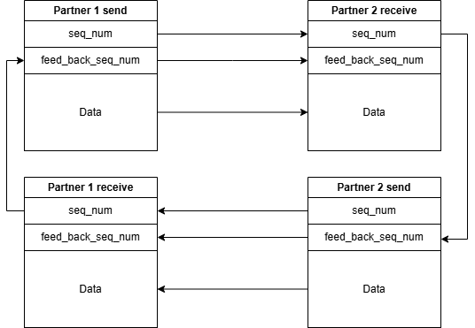

# Netflux Protocol

Netflux is a high-performance Soft-Realtime UDP communication protocol for bridging PLCs, PCs, and other automation devices. It is designed to work where standard proprietary protocols (like Profinet, EtherCAT, or S7-Communication) are too expensive or inflexible, but raw UDP is too unreliable.

It is proven to achieve **1ms cycle times** between CODESYS PLCs and robustly handles cross-platform communication between:
- **CODESYS V3**
- **Siemens S7-1500**
- **Python (PC/Linux/Mac)**

## 🚀 Key Features

- **High Speed**: Optimized for ≤ 2ms data exchange cycles.
- **Reliable**: Implementing a custom "Sequence Number + Feedback" handshake to guarantee packet delivery and order.
- **Cross-Platform**: Seamlessly talk between different brands of PLCs and PC software.
- **Zero Cost**: No licenses, no royalties. Open Source (MIT License).
- **Simple**: Designed to be easier to implement than a standard TCP socket connection.

## 📁 Repository Structure

| Platform | Directory | Description |
|----------|-----------|-------------|
| **CODESYS V3** | [📂 `/Codesys_V3`](Codesys_V3/README.md) | Original implementation. Includes Function Blocks, statistics tuning, and examples. |
| **Siemens S7** | [📂 `/Siemens_S7_1500`](Siemens_S7_1500/README.md) | SCL implementation for S7-1500 (TIA Portal). |
| **Python** | [📂 `/Python`](Python/README.md) | Complete Python 3 implementation for testing, logging, or PC-based control. |
| **Documents** | [📂 `/Diagrams`](Diagrams/) | Protocol design diagrams and documentation assets. |

## 💡 Core Concept

The protocol allows two devices to "handshake" over UDP without the overhead of TCP. 



1. **Send**: Device A sends a packet with a `Sequence Number` (0-255).
2. **Acknowledge**: Device B receives it and echoes that number back as a `Feedback Sequence Number` in its own next packet.
3. **Verify**: Device A sees the feedback and knows the link is healthy.

If a packet is lost, the sequence numbers won't match, and the built-in **Watchdog** or **Statistics Block** will flag an error immediately.

## 🤝 Contributing

We welcome contributions! Please see [CONTRIBUTING.md](CONTRIBUTING.md) for details on how to submit pull requests or report issues.

## 📜 License

This project is licensed under the MIT License - see the [LICENSE](LICENSE) file for details.

## 🔧 Codesys V3 Implementation (v5)

The Codesys V3 implementation has been significantly refactored to a **Unified Socket Architecture** (`fbNetflux_Socket`) to improve reliability and maintainability.

### Key Capabilities
- **Unified Function Block**: Handles both sending and receiving in a single non-blocking state machine.
- **Robust Connection Handling**:
    - **Cold Start Detection**: Automatically resets socket handles on program download/restart.
    - **Fast Port Release**: Uses `SO_REUSEADDR` option to allow immediate reconnection, eliminating the need for controller restarts stuck in `TIME_WAIT`.
    - **Auto-Recovery**: Built-in error recovery mechanism retries connections automatically.
- **Performance Tuning**:
    - Optimized `SysSocket` calls (tuned signatures for speed).
    - Buffer management optimization.
- **Detailed Statistics**:
    - `tPartnerTxPeriod`: Measures the actual reception interval from the partner.
    - `tOwnRealTxPeriod`: Measures the PLC's actual transmission interval.
    - `tInstantRTT`: Estimated Round Trip Time.
    - `uiInstantRxSkipped`: Counters for lost/skipped packets.

### Usage Pattern
The Main program (`MAIN_NETFLUX`) uses an explicit execution order for better control:

```pascal
// 1. Process Receive Logic (inside FB body)
_fbNetflux_Socket(...);

// 2. Execute Application Logic using received data
// ...

// 3. Explicitly Send Data (at end of cycle)
_fbNetflux_Socket.send();

// 4. Update Statistics (optional)
_fbNetflux_Socket.Statistics();
```
